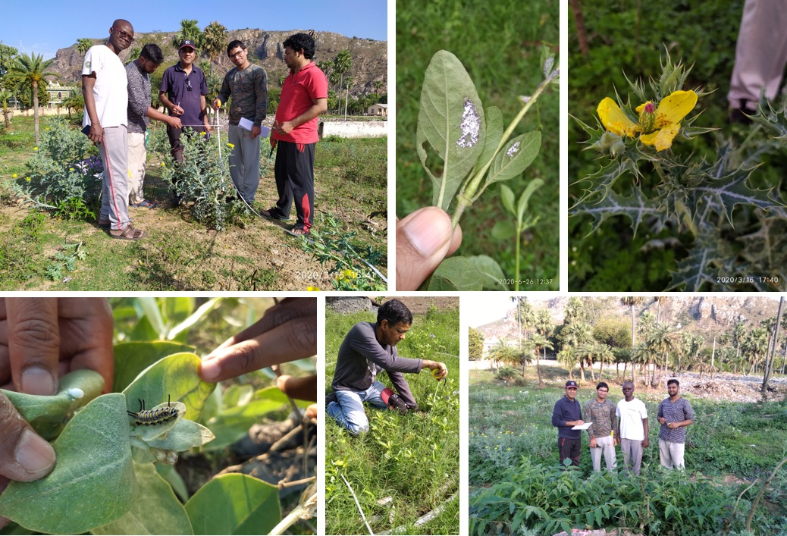
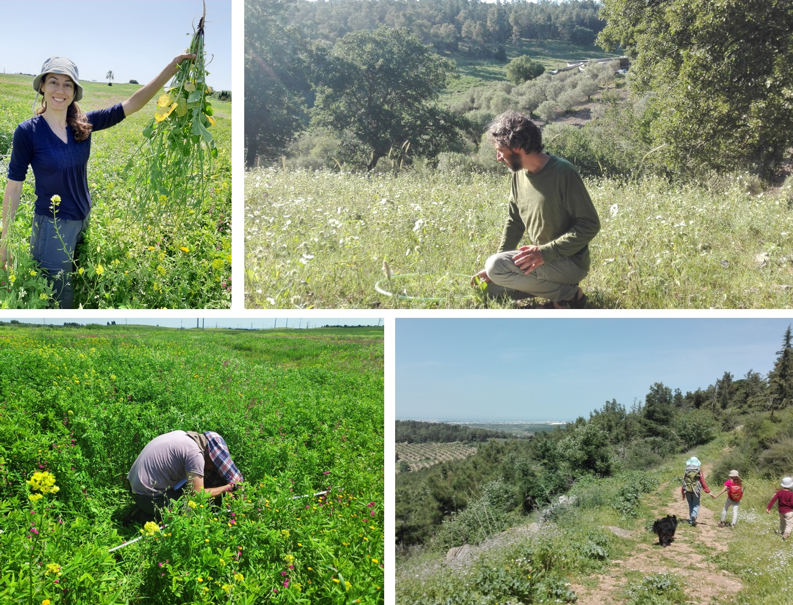
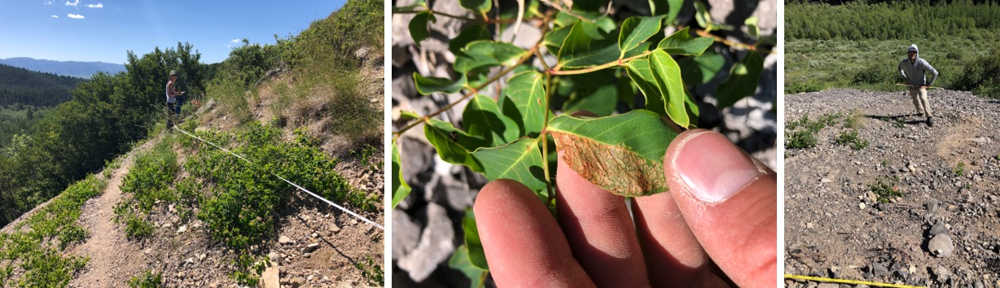
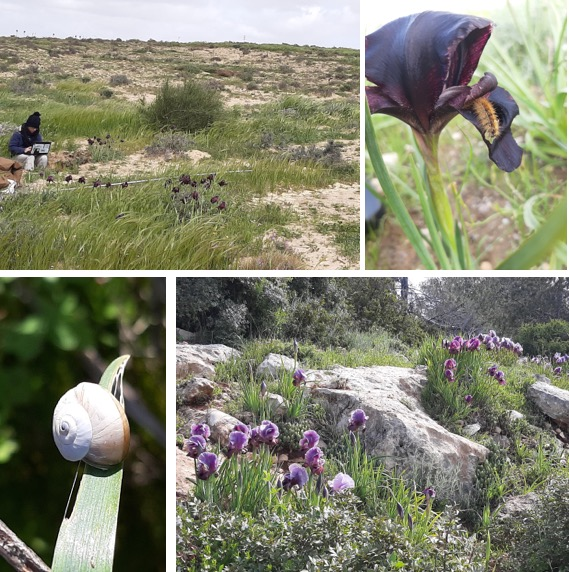
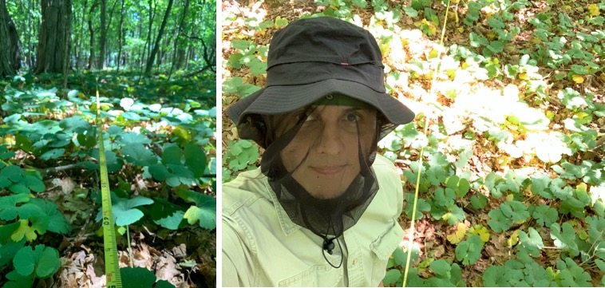
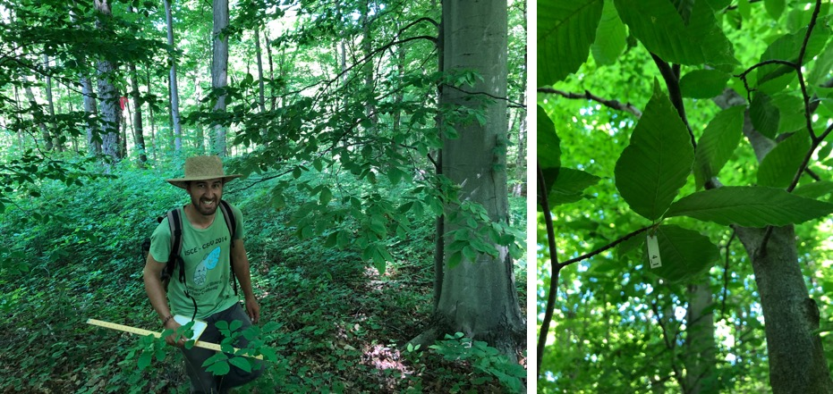

We are a global team of scientists working together to understand how plant-herbivore interactions vary around the world! Below is a selection of photos of us and the plants and herbivores we study. You can find [a list of all our collaborators and their institutions here](CollaboratorDirectory.html).

{width=70%}  
  
&nbsp;

{width=70%}  
  
&nbsp;

{width=70%}  

&nbsp;

{width=70%}  

&nbsp;

{width=70%}  

&nbsp;

{width=70%}  

&nbsp;

{width=70%}  

&nbsp;

{width=70%}  

&nbsp;

{width=70%}  

&nbsp;

{width=70%}  

&nbsp;

{width=70%}  

&nbsp;

{width=70%}  

&nbsp;

{width=70%}  

&nbsp;

{width=70%}  

&nbsp;

{width=70%}  

&nbsp;

{width=70%}  

&nbsp;

{width=70%}  

&nbsp;

{width=70%}  

&nbsp;

{width=70%}  

&nbsp;

{width=70%}  

&nbsp;

{width=70%}  

&nbsp;

{width=70%}  

&nbsp;

