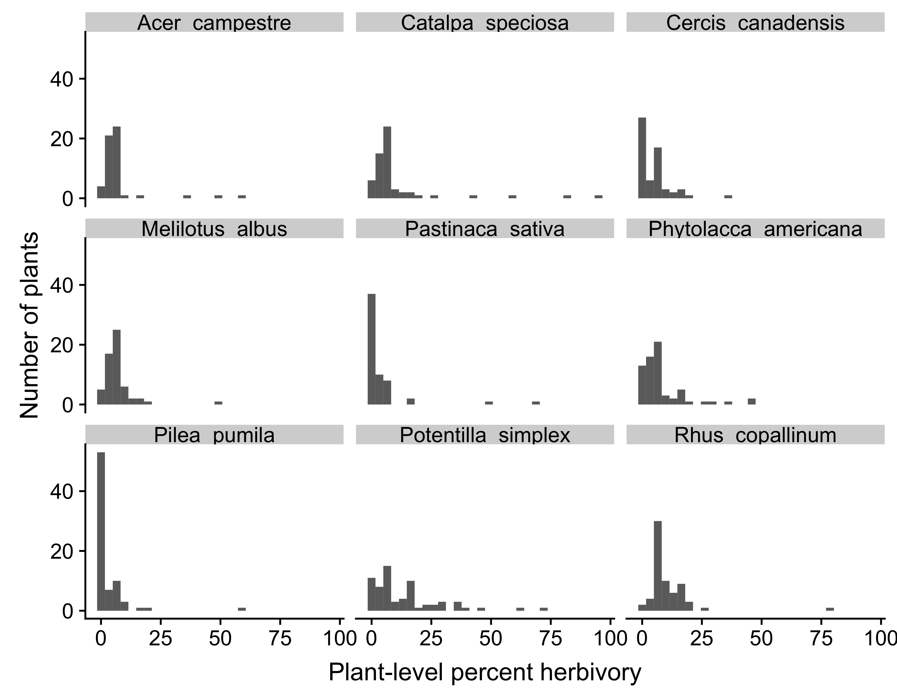

```{r, echo=FALSE, include=FALSE}

# Load packages for this page
library(googlesheets4)
library(ggplot2)
library(viridis)
library(knitr)

# Load metadata on completed surveys
sheets_deauth()
d = read_sheet("https://docs.google.com/spreadsheets/d/1mNYnSTCs9WYy5SN2HF4VYep550Sccz9xU5o8JuYut-A/edit?usp=sharing",
           sheet='Completed surveys')
d = data.frame(d)
```

We are a global network of scientists working together to understand how plant--herbivore interactions vary across the planet, across ecosystems, and across the plant phylogeny. A major focus of our project is the variability itself. **We aim to understand what leads to some species to have high interaction variability and others to have lower variability?**

```{r, echo=FALSE, out.width = "500px", fig.align='center'}
knitr::include_graphics("photos/IMG_2201.jpg")
```

A hallmark of plant-herbivore interactions is that they are tremendously variable across time and space at all levels of biological organization (among species, among populations, among individuals, within individuals). Ecologists and evolutionary biologists have long sought to understand this variation, developing a multitude of hypotheses to explain and predict this common feature in nature; however, a unifying consensus has yet to emerge. There are numerous reasons for this lack of generality: approaches to quantify plant-herbivore interactions often vary, making results difficult to compare; data are collected for single plant or insect species, hindering generality across plant groups; and the context-dependence of interactions further obscures any common trends at broader scales. In addition, most studies distill the herbivory they observe into a single mean value, which ignores the distribution of herbivore interactions among plants within populations. The shape of this distribution is an important aspect plant-herbivore interactions, hinting at mechanisms shaping herbivory as well as the consequences of this herbivory for both plants and insects. 

When the full distribution of herbivore feeding damage is reported, most published studies and personal observations describe a highly skewed shape, such that most plants experience low levels of damage, and a small fraction of plants experience disproportionately high levels of damage.

```{r, echo=FALSE, out.width = "600px", fig.align='center', fig.cap="The distribution of herbivory among plants within populations for nine plant species. Each histrogram shows the number of plant individuals with different levels of percent tissue damaged by herbivores."}

```

Theory suggests that variability and skew in species interactions can have dramatic ecological and evolutionary consequences. For example, variability among plants can lead overall herbivore population size to be greater or less than expected based on average plant quality, and asymmetric fitness surfaces can lead to over-investment in defensive traits. Surprisingly, despite the theoretical importance and potential generality of variability in herbivory, it has received little empirical attention, limiting our fundamental understanding of how plants and herbivores interact.

**We have three initial research questions:**

* Is high variability a ubiquitous feature of plant--herbivore interactions?
* What biotic and abiotic factors are correlated with variability in plant--herbivore interactions?
* What types of plants and ecosystems exhibit higher or lower than average variability?

We are answering these questions by collecting data on the distribution of plant--herbivore interactions in a standardized way from a broad range of plant species and ecosystems. We hope that by identifying the factors that correlate with variability in herbivory we will be able to provide the field with a new paradigm for describing plant--herbivore interactions and generate novel hypotheses about the ecology and evolution of plant--herbivore interactions.


Please see the [Participation page](participation.html) if you are interested in joining us.

<br>

## Taxonomic progress

So far we have completed surveys on more than 125 plant species from more than 50 plant families. These figures and tables update as new data is entered into our database, so check back often!

```{r, echo=FALSE, fig.align='center', fig.width=5, fig.asp=1.5, fig.cap="Number of currently completed surveys per plant family. We have five focal plant families—Apocynaceae, Asteraceae, Fabaceae, Rubiaceae, and Solanaceae, in yellow—that we are sampling intensively to give us a detailed phylogenetic look at variation in herbivory."}
focalFam = function(z) # define function to ID focal families in data frame
	ifelse(z == 'Apocynaceae' | z == 'Asteraceae' | z == 'Fabaceae' | z == 'Solanaceae' |
		z == 'Rubiaceae', TRUE, FALSE)
d$focalFamily = focalFam(d$plantFamily)

d.complete = d[!is.na(d$plantFamily),] # data.frame for complete entries

ggplot(d.complete, aes(x=plantFamily, fill=focalFamily)) + geom_bar() + coord_flip() + 
	ylab('No. surveys') + xlab('Plant family') + theme_classic() +
	scale_fill_viridis(discrete=TRUE, alpha=0.8) + theme(legend.position = "none")
```


<br>


```{r, echo=FALSE}
num.spp = table(d.complete$Genus_sp)
kable(num.spp, col.names=c('Plant species', 'No. surveys'), caption = "Our current species list with the number of surveys completed for each species.", align=c('l','l'))
```
