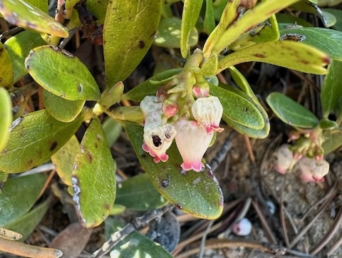
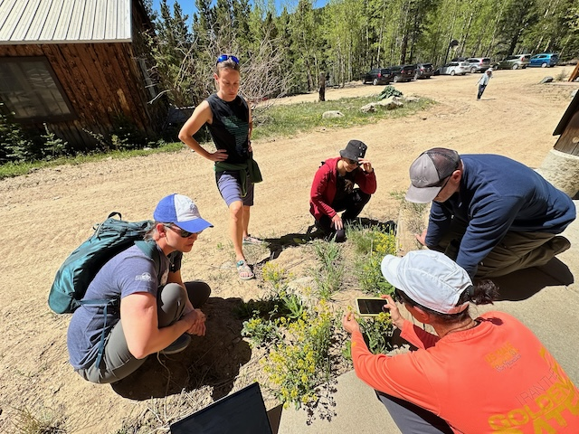
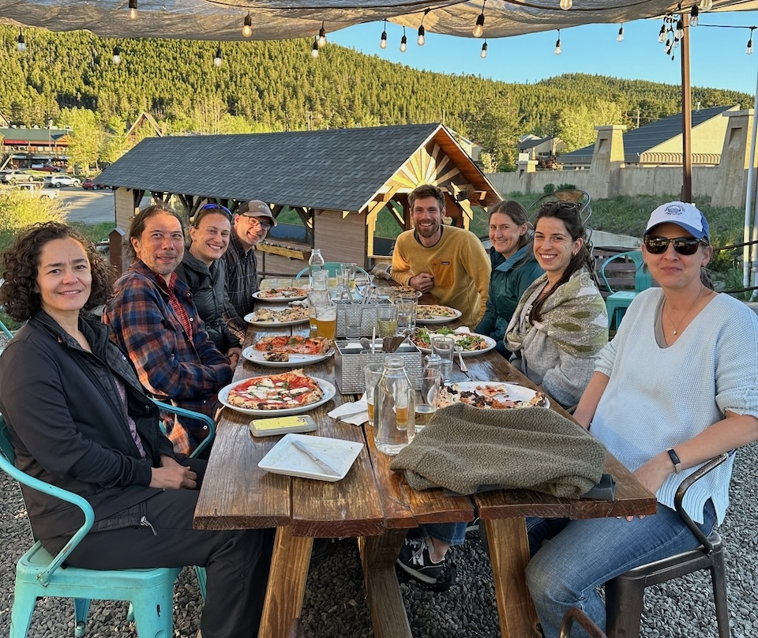

\thispagestyle{empty}

<!-- ```{r setup_syllabus, include=FALSE} -->
<!-- knitr::opts_chunk$set(echo = TRUE) -->
<!-- library(RColorBrewer) -->
<!-- library(viridis)    -->
<!-- ``` -->

<!-- ```{r banner, echo=FALSE, include=TRUE, out.width = '100%', fig.align="center"} -->
<!-- knitr::include_graphics("./icons/banner.png") -->
<!-- # knitr::include_graphics("./icons/hummingbird.png") -->
<!-- ``` -->

```{r setup, include=FALSE}
knitr::opts_chunk$set(echo = TRUE)
```

Dear HerbVar members,

Greetings and Happy New Year! The HV Steering Committee has spent the last year building the infrastructure to bring our network into its next stage of collaboration! We are writing with four big updates:

1. **[New HerbVar Manual and collaborative GitHub organization](#manual)**  
2. **[Help Wanted: Data on damage to reproductive structures](#help)**  
3. **[Update on new papers and Working Groups](#wg1)**   
4. **[Call for Proposals: New HerbVar Working Groups](#wg2)**   


## New HerbVar Manual and collaborative GitHub organization{#manual}

Emilio Bruna has led an amazing effort to bring cutting edge collaboration techniques to HV. As part of this, we have migrated our collaborative infrastructure from Google Drive to a collaborative GitHub Organization: https://github.com/HerbVar-Network. This will facilitate sharing data and code among new Working Groups. It includes automated scripts for downloading and wrangling HV data. As part of this, we have also collected all of our diverse materials (protocols, guides, and policies) into a single, centralized HV Manual, which can be viewed via our GitHub Organization as an [HTML book](https://herbvar-network.github.io/herbvar_manual/) or a [PDF](https://herbvar-network.github.io/herbvar_manual/herbvar-manual.pdf). You can contribute to the manual by suggesting edits through the [GitHub repository for the manual](https://github.com/HerbVar-Network/herbvar_manual).

<div style="float: right">
{width=200}
</div>

The manual is also citable - please cite it if you use or build off of a HV protocol: 

> “HerbVar Steering Committee (2024). HerbVar: Project Manual and Field protocols (v0.9.0). Zenodo. https://doi.org/10.5281/zenodo.14232308.”

Thanks to Emilio Bruna for helping to make HV a leader in collaborative ecological networks!


## Help Wanted: Data on damage to reproductive structures{#help}

Please consider participating in our current sampling objectives! Our most pressing need is data from reproductive damage surveys. We currently have about 70 reproductive surveys. The preliminary results are very exciting. We think that the reproductive paper will be as important as our Science paper, but we need bigger sample sizes to be able to test big ideas. So we encourage everyone to take a few days to collect and submit data using our Reproductive Protocol, which has been polished recently and included in the [HV Manual](https://herbvar-network.github.io/herbvar_manual/protocols/repro_damage.html). Susan Whitehead is planning to lead the Reproductive Damage Working Group. 

<div style="float: left">
{width=200}
</div>

Our additional objectives include data from our focal families and focal species. And, as always, we are willing to accept any data following an HV protocol with any plant species. Data submission helps us grow our public database for the benefit of the whole field. Of course, surveys with species that aren’t currently part of a major sampling objective may take longer to lead to a Working Group publication, unless you decide to lead one! See below.


## Update on new papers and Working Groups{#wg1}

We are excited to announce the initiation of several new HV Working Groups. The list of Working Groups can be found [here](https://herbvar.org/workingGroups.html). The Spatial Pattern Working Group (led by Will Wetzel) will include as co-authors all HV members who contributed data (Site PIs), including everyone who contributed data to our Science paper. The Focal Family Working Group (led by Ivalú Cacho) will include all HV Site PIs who contributed focal family data. An Education Working Group (led by Nora Underwood) has started collecting materials related to teaching about biological variability. Stay tuned to hear more from the leaders of these Working Groups.

<div style="float: right">
{width=200}
</div>

## Call for Proposals: New HerbVar Working Groups{#wg2}

We are now open to considering proposals for new HV Working Groups from any HV member. This includes Working Groups that use existing data or Working Groups that develop and circulate new, add-on data collection protocols. If you are interested in leading a Working Group, please review the relevant section of the HV Manual, which describes the [process for proposing and initiating a Working Group](https://herbvar-network.github.io/herbvar_manual/collaboration/working-group-pubs.html).

Thank you so much for being part of HerbVar!

Warm regards,  
The HV Steering Committee

Karen Abbott  
Emilio Bruna  
Ivalú Cacho  
Lee Dyer  
Phil Hahn  
Brian Inouye  
Nora Underwood  
Will Wetzel  
Susan Whitehead


{width=400}


---
## Stay in touch

You can read this and all prior newsletters on our [website](https://herbvar.org/), where you can also get updates on ongoing projects and download the most recent HerbVar [publications](https://herbvar.org/products.html).


