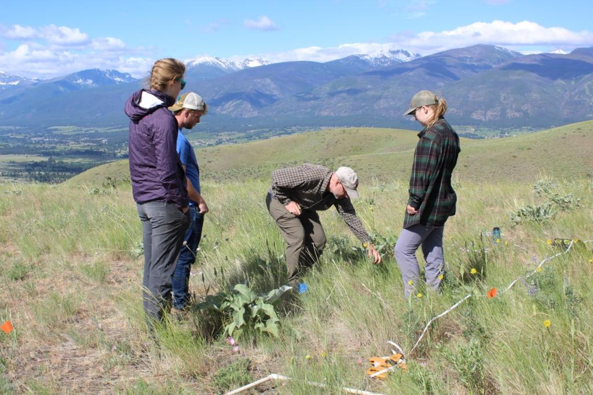

```{r, include=FALSE}
library(googlesheets4)
library(knitr)
sheets_deauth()
coll = read_sheet("https://docs.google.com/spreadsheets/d/1UwM5VR_msyIEyCpIGllfaLD4K4mqKyU5LfsCTwYEvwo/edit?usp=sharing",
           sheet='collaborator list')
coll = data.frame(coll)
```


```{r, echo=FALSE, out.width = "500px", fig.align='center'}

```


```{r, echo=FALSE}
ctab = data.frame(
  name = paste(coll$first.name, coll$last.name, sep=' '),
  ins = coll$institution,
  ap = coll$additional.participants
)
ctab$ap = as.character(ctab$ap)
ctab$ap[is.na(ctab$ap)] = ''
kable(ctab, col.names=c('Site PI', 'Institution', 'Additional Participants'), align=c('l','l','l'))
```


```{r, echo=FALSE, out.width = "500px", fig.align='center'}
knitr::include_graphics("photos/IMG_2382.jpg")
```
