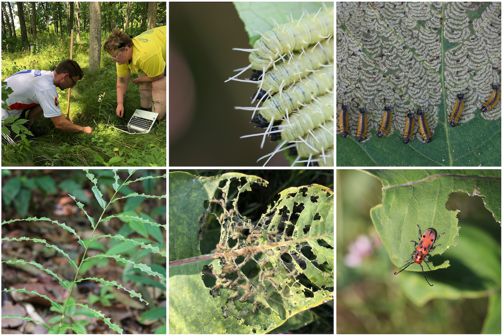

Welcome to the Herbivory Variability Network ("HerbVar"). We are a global research network that aims to describe and understand how and why patterns in plant--herbivore interactions vary across the tree of life and around the world.

```{r, echo=FALSE, out.width = "600px", fig.align='center'}

```

Although we are a new network (founded in mid 2019), we already have 100+ collaborators from more than 60 institutions across 23 countries. Please email [Will Wetzel, Moria Robinson, or a member of the HerbVar Planning Group](leadership.html) if you are interested in joining us. We are always looking for additional collaborators, especially those who can contribute data from under-sampled regions or from new plant families or focal plant families and species.


Our growing dataset currently includes ca. 150 surveys, including > 125 plant species from > 50 plant families. These are spread across North America, Central America, South America,  Europe, Africa, and Asia, and we are working to expand our geographic extent.

```{r, echo=FALSE, out.width = "600px", fig.align='center', fig.cap="Sampling areas with at least one completed survey (yellow) and planned sampling areas (purple). We’re continually adding new planned sites."}
knitr::include_graphics("photos/Map_2019-12-01.png")
```


<br>
<br>
<br>

***

<center> _This website was written in R and R Markdown and is hosted via GitHub. The source code is available in a public [GitHub repository](https://github.com/wcwetzel/HerbVar.github.io)._ </center>