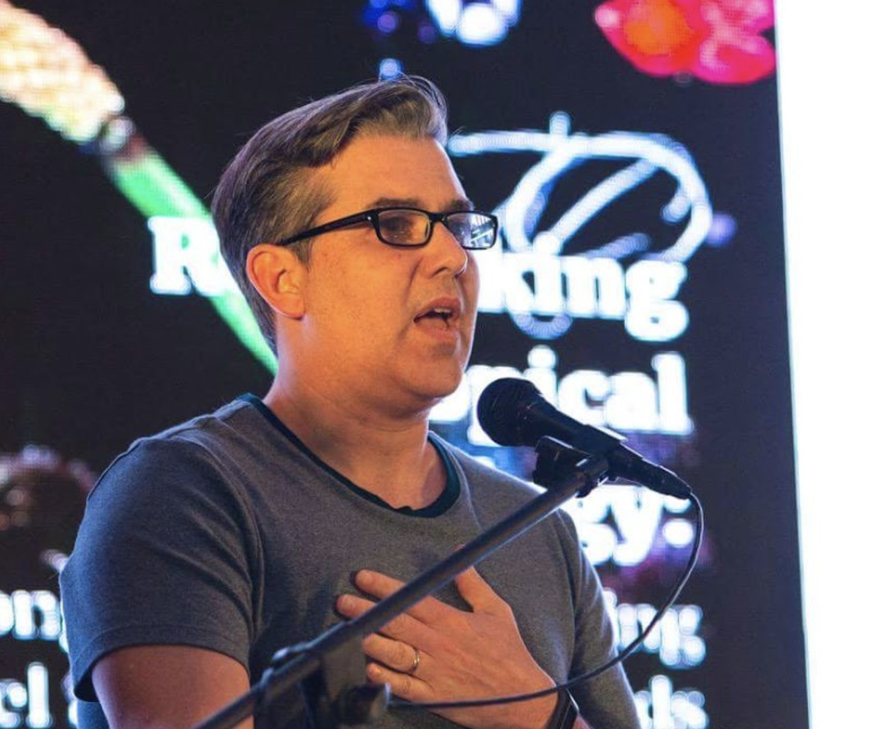
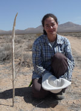
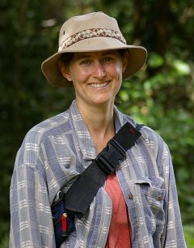

HerbVar was founded by the [Wetzel Lab at Michigan State University](https://WetzelLab.com). It is led by a Steering Committee and multiple Subgroups that focus on specific topics. Please feel free to email **herbvar(a)gmail.com** or members of the Steering Committee or Coordination Staff if you are interested in the project. For information on how our network runs, please see the [HerbVar Document of Collaboration](https://docs.google.com/document/d/1nBNIkY6ICaRr-zE3DRg357-FZoB2X-mM/edit?usp=sharing&ouid=107899855781798259282&rtpof=true&sd=true).


<br>

## HerbVar Steering Committee

```{r, echo=FALSE, out.width = "100px"}
knitr::include_graphics("photos/people/wetzel.jpg")
``` 

**Dr. Will Wetzel**  
Department of Entomology; Department of Integrative Biology  
Ecology, Evolutionary Biology, & Behavior Program  
Michigan State University  
wcwetzel (a) msu.edu • [website](https://WetzelLab.com)  
*(Lead PI, Asteraceae Coordinator)*  
<br>

```{r, echo=FALSE, out.width = "100px"}
knitr::include_graphics("photos/people/abbott.jpg")
``` 

**Dr. Karen Abbott**  
Department of Biology  
Case Western Reserve University  
kcabbott (a) case.edu • [website](https://abbottlab480702554.wordpress.com)  
<br>

```{r, echo=FALSE, out.width = "100px"}

``` 

**Dr. Emilio Bruna**  
Dept of Wildlife Ecology & Conservation; Center for Latin American Studies  
University of Florida  
embruna (a) ufl.edu • [website](http://brunalab.org/)  
<br>

```{r, echo=FALSE, out.width = "100px"}

```

**Dr. N. Ivalú Cacho**  
Departamento de Botánica  
Instituto de Biología, UNAM  
ivalu.cacho (a) ib.unam.mx • [website](https://ivalucacho.weebly.com/)  
<br>

```{r, echo=FALSE, out.width = "100px"}
knitr::include_graphics("photos/people/dyer.jpg")
```

**Dr. Lee Dyer**  
Department of Biology  
Ecology, Evolution and Conservation Program  
University of Nevada, Reno  
ldyer (a) unr.edu • [website](https://www.unr.edu/biology/people/lee-dyer)  
*(Ecosystems and Biomes Coordinator)*  
<br>

```{r, echo=FALSE, out.width = "100px"}
knitr::include_graphics("photos/people/hahn.jpg")
```

**Dr. Phil Hahn**  
Department of Entomology & Nematology  
University of Florida  
hahnp (a) ufl.edu • [website](https://plant-herbivore-interactions.net/)  
*(Apocynaceae and Solanaceae Coordinator)*  
<br>

```{r, echo=FALSE, out.width = "100px"}
knitr::include_graphics("photos/people/inouye.jpeg")
```

**Dr. Brian Inouye**  
Department of Biological Science  
Florida State University  
bdinouye (a) bio.fsu.edu • [website](https://www.bio.fsu.edu/faculty.php?faculty-id=bdinouye)  
<br>

```{r, echo=FALSE, out.width = "100px"}

```

**Dr. Nora Underwood**  
Department of Biological Science  
Florida State University  
nunderwood (a) bio.fsu.edu • [website](https://www.bio.fsu.edu/~nunderwood/homepage/)  
*(Solanaceae Coordinator)*  
<br>

```{r, echo=FALSE, out.width = "100px"}
knitr::include_graphics("photos/people/whitehead.jpg")
```

**Dr. Susan Whitehead**  
Department of Biological Sciences  
Virginia Tech  
swhitehead (a) vt.edu • [website](http://www.speciesinteractions.com/)  
*(Focal Species Coordinator)*  
<br>


## HerbVar Coordination Staff

**Dr. Will Wetzel**, Lead PI  
Department of Entomology  
Ecology, Evolutionary Biology, & Behavior Program  
Michigan State University  
wcwetzel (a) msu.edu  

**Luke Zehr**, Research Scientist  
Department of Entomology  
Michigan State University  

**Nick Lyon**, Data Scientist  
Department of Entomology  
Michigan State University
herbvar (a) gmail.com

<br>

## Damage Estimation Subgroup

**Dr. Bastien Castagneyrol**  
BIOGECO, INRA  
University of Bordeaux  

**Julie Davis**  
Department of Entomology  
Cornell University  

**Zoe Getman-Pickering**  
Department of Entomology  
Cornell University  

**Dr. Ian Pearse**  
Fort Collins Science Center  
US Geological Survey  

**Dr. Will Wetzel**  
Department of Entomology  
Ecology, Evolutionary Biology, & Behavior Program  
Michigan State University  
<br>

## Reproductive Damage Subgroup

**Dr. Phil Hahn**  
Department of Entomology & Nematology  
University of Florida  

**Dr. Paul Ode**  
Bioagricultural Sciences & Pest Management  
Colorado State University  

**Dr. Susan Whitehead**  
Department of Biological Sciences  
Virginia Tech  
<br>


## Insect Sampling Subgroup

**Dr. Tania Kim**  
Department of Entomology  
Kansas State University  

**Dr. Nick Pardikes**  
Institute of Entomology  
Czech Academy of Sciences  

**Dr. Moria Robinson**  
Department of Entomology  
Michigan State University  

**Luke Zehr**  
Department of Entomology  
Michigan State University  
<br>


## Rare Plants Subgroup

**Dr. Lee Dyer**  
Department of Biology  
Ecology, Evolution and Conservation Program  
University of Nevada, Reno  

**Danielle Salcido**  
Department of Biology  
Ecology, Evolution and Conservation Program  
University of Nevada, Reno  
<br>


## Predictors of Variability Subgroup 

**Dr. Paul Ode**  
Bioagricultural Sciences & Pest Management  
Colorado State University  

**Dr. Ian Pearse**  
Fort Collins Science Center  
US Geological Survey  
<br>


## Succulent Subgroup

**Dr. Judie Bronstein**  
Ecology and Evolutionary Biology  
University of Arizona  

**Victoria Luizzi**  
Ecology and Evolutionary Biology  
University of Arizona  
<br>


## Tree Subgroup

**Dr. Bastien Castagneyrol**  
BIOGECO, INRA  
University of Bordeaux  

**Dr. Amy Trowbridge**  
Department of Entomology  
University of Wisconsin, Madison  
<br>

