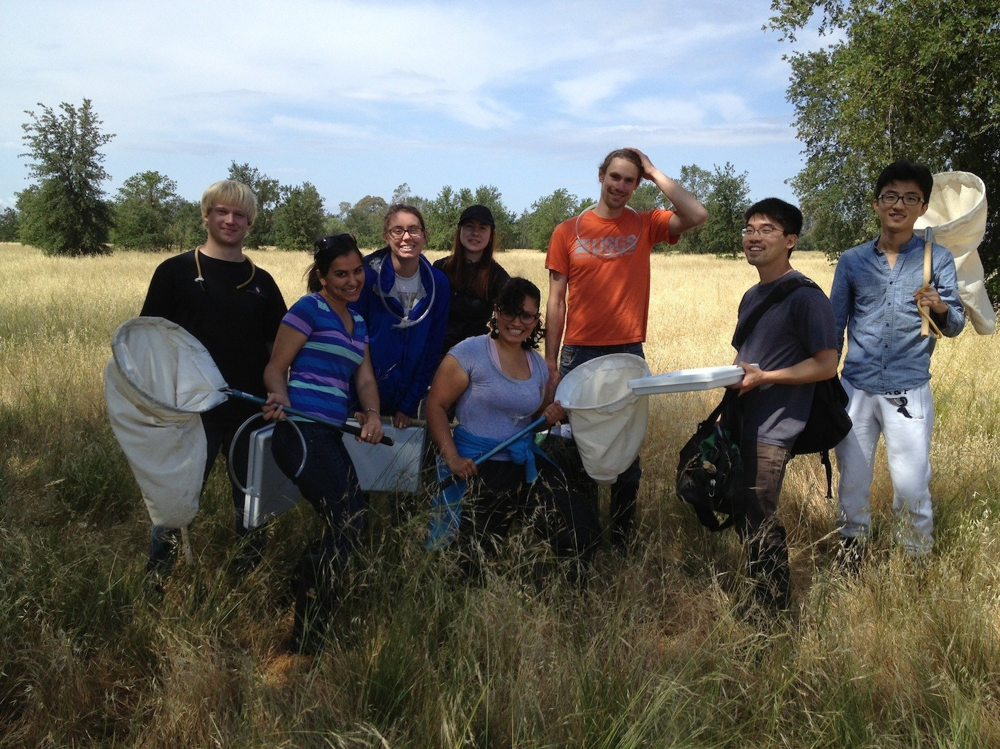

```{r setup, include=FALSE}
knitr::opts_chunk$set(echo = TRUE)
```

We are a collaborative and inclusive group of scientists and educators who are working together to advance our understanding of plant--herbivore interactions. Please contact us if you are interested in joining. You can email Will Wetzel (wcwetzel@msu.edu), Moria Robinson (robi1169@msu.edu), or any other member of the [Planning Group](leadership.html).

Herbvar is open to professional biologists [or educators](#edu) who are collaborative, collegial, and willing to collect and contribute standardized data on the distribution of herbivory. We are especially interested in gaining data for new species and sites, as well as for focal plant families and species (see the [HerbVar Species Selection Plan](protocols/HerbVar Species Selection Plan.pdf)). Collaborators can participate by using our protocols to survey herbivory. Collaborators are also welcome to join leadership Subgroups if they are motivated and willing to invest significant time into the development of HerbVar.

Collaborators should

* Be professional researchers with expertise in plant-herbivore interactions
* Be inclusive, collegial, and collaborative in their interactions with other members of HerbVar
* Fund research at their own sites
* Contribute data gathered using the HerbVar protocol or a modified protocol approved by the Planning Group (see [HerbVar protocols](protocols.html))

Collaborators will be included as co-authors on HerbVar manuscripts if they

* Contribute data from 5 or more surveys (ideally); 3 at the very least. We suggest these include:
  + 1 new plant family or ecosystem
  + 1 new species from one of our focal families (Apocynaceae, Asteraceae, Fabaceae, Rubiaceae, and Solanaceae)
  + 1 survey from a focal species (_Taraxacum officinale_, _Plantago lanceolata_, and _Plantago major_)
* Contribute intellectually to at least one of the following:
  + Development of questions and overall study design
  + Data analysis
  + Writing
  + Editing

For more information on participation and how our network runs, please see the [HerbVar Document of Collaboration](/protocols/HerbVar Document of Collaboration.pdf).

```{r, echo=FALSE, out.width = "500px", fig.align='center'}

```


## Participating as an educator {#edu}
Some of our collaborators use **HerbVar as an experiential learning tool**. They take students into the field; teach them about ecology, plant--animal interactions, scientific study-design, and other topics; train them in the relevant sampling methods; collect real data with the students; and contribute the data to the network. If you are an educator and are intersted in using HerbVar in your teaching and/or becoming a collaborator, please [email us](leadership.html).


