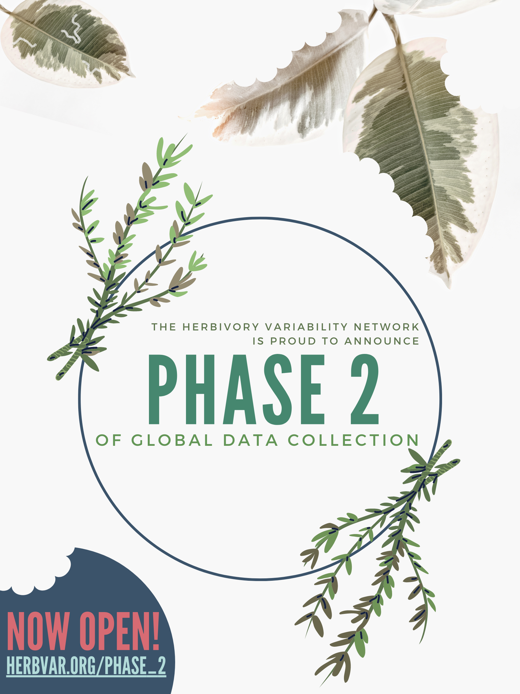

## Phase 2 of Global Data Collection is Open!

```{r setup, include=FALSE}

# Load packages for this page
library(googlesheets4)
library(ggplot2)
library(viridis)
library(knitr)
library(ggmap)
library(tidyverse)

# Load metadata on completed surveys
gs4_deauth()
d = read_sheet("https://docs.google.com/spreadsheets/d/1mNYnSTCs9WYy5SN2HF4VYep550Sccz9xU5o8JuYut-A/edit?usp=sharing",
           sheet='Completed surveys')
d = data.frame(d)

# Drop rows without an entry for Genus_sp
d = subset(d, !is.na(d$Genus_sp))

```

We are excited to announce that our second phase of data collection is open! Phase 1 of data collection for the Herbivory Variability Network was a major success with **`r nrow(d)` surveys on `r length(unique(d$Genus_sp))` plant species from `r length(unique(d$plantFamily))` plant families**. This has shown us that there is strong interest in variability and large-scale collaborations within the plant-herbivore research community and inspired us to keep on. Please email **herbvar (a) gmail.com** or one of the [Steering Committee members](leadership.html) if you are interested in joining us and/or have any questions.

We have revised our [primary and alternate protocols](https://drive.google.com/drive/folders/1PWeoPEC1u6ErQWRCik8cHyTJNqOVE-DV?usp=sharing) following feedback from collaborators on Phase 1 so **feel free to download and explore any relevant protocol**. The changes are minor tweaks and clarifications, and the Phase 2 protocols are mostly the same as the Phase 1 protocols.

<br>

## Phase 2 Objectives

Based on phase 1 of data collection, we have developed the following sampling objectives (described more fully [here](https://docs.google.com/document/d/1-p8oQkrgqM_E3uzMf2Ihqs_c5PE54PVVhHHjRru8_qA/edit?usp=sharing). We ask that you prioritize these in your species and site selections:

* Surveys of the three focal species (_Taraxacum officinale_, _Plantago lanceolata_, and _Plantago major_), especially across broad environmental and/or geographic ranges

* Surveys of species in the five focal families (**Apocynaceae**, **Asteraceae**, **Fabaceae**, **Rubiaceae**, and **Solanaceae**). We want surveys of new species within these families, especially species from new clades or with unusual growth forms. For repeat surveys of species within these families, we are prioritizing surveys from new regions, habitats, elevations, etc.

* Surveys of damage to any species’ reproductive tissues (e.g., flowers, fruits, etc.)

We envision at least one publication per sampling objective. Collecting at least three surveys for an objective will earn you authorship on the primary paper for that objective (and please see our [Participation page](participation.html) for other authorship requirements).

## New Data Submission Portal

For this phase of data collection we have created a [data submission portal](https://herbvar.shinyapps.io/data_portal_actual/) with R Shiny! All data submission for this phase will go through it but it does require you use the updated [template Excel file](protocols/HerbVar Datasheet Template.xlsx).

## Spread the Word!

Please feel free to share our announcement flyer with colleagues you think might be interested in joining the Network or on social media!

```{r, echo=FALSE, out.width = "700px", fig.align='center', dpi=72}

```

If you have questions please also feel free to email herbvar (a) gmail.com and we will do our best to respond promptly.
