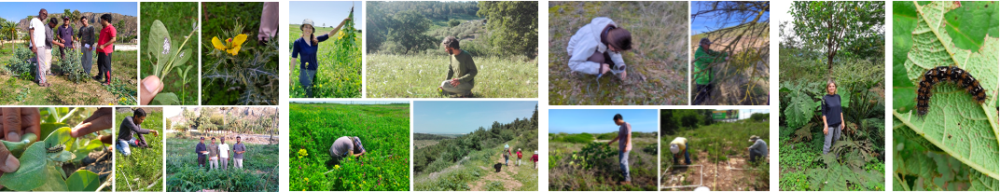
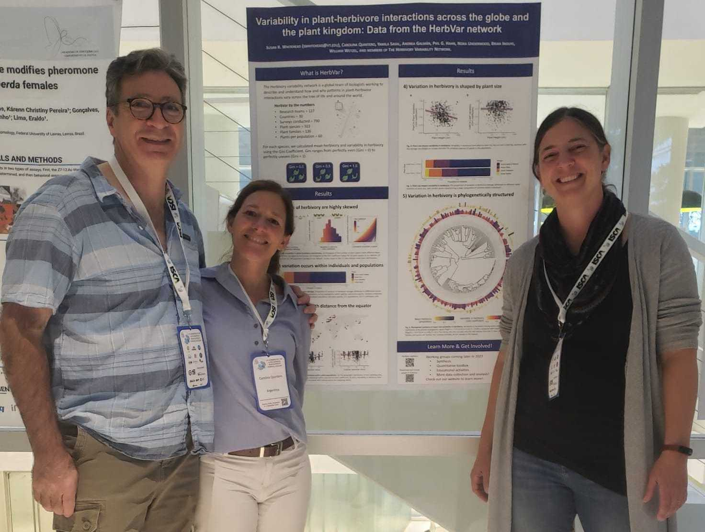
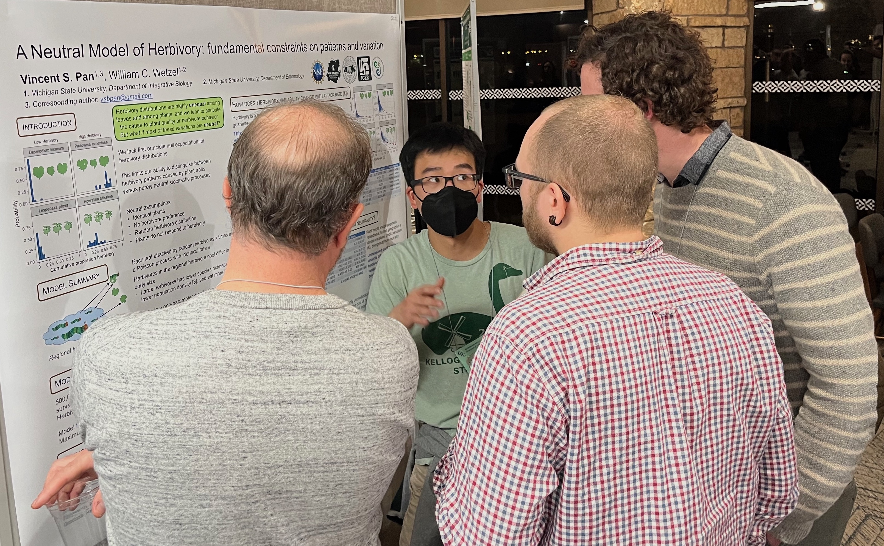
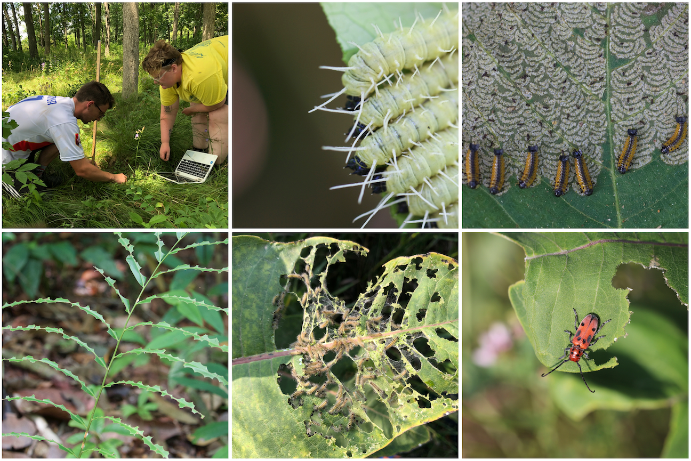

```{r, echo=FALSE, out.width = "650px", fig.align='center', dpi=72}

```

## Publications

Galmán, A.C., P.G. Hahn, B.D. Inouye, N. Underwood, Y. Liu, S.R. Whitehead, and W.C. Wetzel. *In revision*. Global test of the enemy release hypothesis reveals similar patterns of herbivory across native and non-native plants.

Pan, V.S., and W.C. Wetzel. 2024. Neutrality in plant-herbivore interactions. Proceedings of the Royal Society B: Biological Sciences 291: 20232687. ([link](https://doi.org/10.1098/rspb.2023.2687)) ([pdf](products/pan-and-wetzel-2024-proc-b.pdf))

```{r, echo=FALSE, out.width = "300px", out.extra='style="float:right; padding:10px"', dpi=72}
knitr::include_graphics("products/Science research highlight 2023-11-10.png")
```
**The Herbivory Variability Network**, M.L. Robinson, P.G. Hahn, B.D. Inouye, N. Underwood, S.R. Whitehead, K.C. Abbott, E.M. Bruna, N.I. Cacho, L.A. Dyer, L. Abdala-Roberts, W.J. Allen, J.F. Andrade, D.F. Angulo, D. Anjos, D.N. Anstett, R. Bagchi, S. Bagchi, M. Barbosa, S. Barrett, C.A. Baskett, E. Ben-Simchon, K.J. Bloodworth, J.L. Bronstein, Y.M. Buckley, K.T. Burghardt, C. Bustos-Segura, E.S. Calixto, R.L. Carvalho, B. Castagneyrol, M.C. Chiuffo, D. Cinoğlu, E. Cinto Mejía, M.C. Cock, R. Cogni, O.L. Cope, T. Cornelissen, D.R. Cortez, D.W. Crowder, C. Dallstream, W. Dáttilo, J.K. Davis, R.D. Dimarco, H.E. Dole, I.N. Egbon, M. Eisenring, A. Ejomah, B.D. Elderd, M.-J. Endara, M.D. Eubanks, S.E. Everingham, K.N. Farah, R.P. Farias, A.P. Fernandes, G.W. Fernandes, M. Ferrante, A. Finn, G.A. Florjancic, M.L. Forister, Q.N. Fox, E. Frago, F.M. França, A.S. Getman-Pickering, Z. Getman-Pickering, E. Gianoli, B. Gooden, M.M. Gossner, K.A. Greig, S. Gripenberg, R. Groenteman, P. Grof-Tisza, N. Haack, L. Hahn, S.M. Haq, A.M. Helms, J. Hennecke, S.L. Hermann, L.M. Holeski, S. Holm, M.C. Hutchinson, E.E. Jackson, S. Kagiya, A. Kalske, M. Kalwajtys, R. Karban, R. Kariyat, T. Keasar, M.F. Kersch-Becker, H.M. Kharouba, T.N. Kim, D.M. Kimuyu, J. Kluse, S.E. Koerner, K.J. Komatsu, S. Krishnan, M. Laihonen, L. Lamelas-López, M.C. LaScaleia, N. Lecomte, C.R. Lehn, X. Li, R.L. Lindroth, E.F. LoPresti, M. Losada, A.M. Louthan, V.J. Luizzi, S.C. Lynch, J.S. Lynn, N.J. Lyon, L.F. Maia, R.A. Maia, T.L. Mannall, B.S. Martin, T.J. Massad, A.C. McCall, K. McGurrin, A.C. Merwin, Z. Mijango-Ramos, C.H. Mills, A.T. Moles, C.M. Moore, X. Moreira, C.R. Morrison, M.C. Moshobane, A. Muola, R. Nakadai, K. Nakajima, S. Novais, C.O. Ogbebor, H. Ohsaki, V.S. Pan, N.A. Pardikes, M. Pareja, N. Parthasarathy, R.R. Pawar, Q. Paynter, I.S. Pearse, R.M. Penczykowski, A.A. Pepi, C.C. Pereira, S.S. Phartyal, F.I. Piper, K. Poveda, E.G. Pringle, J. Puy, T. Quijano, C. Quintero, S. Rasmann, C. Rosche, L.Y. Rosenheim, J.A. Rosenheim, J.B. Runyon, A. Sadeh, Y. Sakata, D.M. Salcido, C. Salgado-Luarte, B.A. Santos, Y. Sapir, Y. Sasal, Y. Sato, M. Sawant, H. Schroeder, I. Schumann, M. Segoli, H. Segre, O. Shelef, N. Shinohara, R.P. Singh, D.S. Smith, M. Sobral, G.C. Stotz, A.J.M. Tack, M. Tayal, J.F. Tooker, D. Torrico-Bazoberry, K. Tougeron, A.M. Trowbridge, S. Utsumi, O. Uyi, J.L. Vaca-Uribe, A. Valtonen, L.J.A. van Dijk, V. Vandvik, J. Villellas, L.P. Waller, M.G. Weber, A. Yamawo, S. Yim, P.L. Zarnetske, L.N. Zehr, Z. Zhong, and W.C. Wetzel. 2023. Plant size, latitude, and phylogeny explain within-population variability in herbivory. Science 382: 679-683. ([link](https://doi.org/10.1126/science.adh8830)) ([pdf](products/herbvar-et-al-2023-science.pdf)) ([paper highlighted by Science editors](products/science-research-highlights-2023-11-10.pdf))

Wetzel, W.C., B.D. Inouye, P.G. Hahn, S.R. Whitehead, and N. Underwood. 2023. Variability in plant–herbivore interactions. Annual Review of Ecology, Evolution, and Systematics 54: 451-474. ([link](https://doi.org/10.1146/annurev-ecolsys-102221-045015)) ([pdf](products/wetzel-et-al-2023-arees.pdf))


## Presentations

```{r, echo=FALSE, out.width = "300px", out.extra='style="float:right; padding:10px"', dpi=72}

```

Wetzel, W.C.... and **the members of The Herbivory Variability Network**. 2025. Global patterns of spatial autocorrelation in herbivory. Plant-Herbivore Interactions Gordon Research Conference. Pomona, CA, USA.

Galmán, A.G., ... 2025. Beyond the mean, how plant growth-defense strategies influence intrapopulation variation of herbivory. Plant-Herbivore Interactions Gordon Research Conference. Pomona, CA, USA.

Hahn, P.G., ... 2025. Variation in herbivory across global environmental gradients. Plant-Herbivore Interactions Gordon Research Conference. Pomona, CA, USA.

Galmán, A., W.C. Wetzel, N. Underwood, B. D. Inouye, P. G. Hahn, and S. R. Whitehead. 2024. Global analyses of enemy release hypothesis and the effects of environment and plant growth form. International Congress of Entomology, Kyoto, Japan.

Whitehead, S.R., C. Quintero, Y. Sasal, A. Galmán, P.G. Hahn, N. Underwood, B.D. Inouye, and W.C. Wetzel. From leaf to biome: multi-scale variability in plant-herbivore interactions. 2024. Annual Meeting of the Ecological Society of America, Long Beach, California.

Galmán, A., P. G. Hahn, B. D. Inouye, N. Underwood, Y. Liu, S. R. Whitehead, and W.C. Wetzel. 2024. Global analyses of enemy release indicate similar herbivory mean and variability across native and non-native plants regardless of environment and plant characteristics. Annual Meeting of the Ecological Society of America, Long Beach, California.

Whitehead, S.R., C. Quintero, Y. Sasal, A. Galmán, P.G. Hahn, N. Underwood, B. Inouye, W.C. Wetzel, and **members of The Herbivory Variability Network**. 2023. Variability in plant-herbivore interactions aross the globe and the plant kingdon: data from the HerbVar Network. Latin American Society for Chemical Ecology, Buenos Aires, Argentina.

Galmán, A., P.G. Hahn, B.D. Inouye, N. Underwood, S.R. Whitehead, the members of The Herbivory Variability Network, and W.C. Wetzel. 2023. Plant diversity determines differences in plant-herbivory interactions in native and exotic plants. Annual Meeting of the Ecological Society of America, Portland, OR.

Wetzel, W.C. 2023. Macroecological and macroevolutionary patterns of variability in plant–herbivore interactions. Advances in Mathematical Ecology, University of Pittsburgh, Pittsburgh, PA, USA.

Hahn, P.G., N.I. Cacho, B.D. Inouye, N. Underwood, A. Whitehead, W.C. Wetzel and **the members of The Herbivory Variability Network**. 2023. Viva Variability!: Herbivory across the plant kingdom. Plant-Herbivore Interactions Gordon Research Conference. Ventura, CA, USA.

Pan, V.S., and W.C. Wetzel 2023. A neutral model of herbivory: fundamental constraints on patterns and variation. Plant-Herbivore Interactions Gordon Research Conference. Ventura, CA, USA.
```{r, echo=FALSE, out.width = "300px", out.extra='style="float:left; padding:10px"', dpi=72}

```

Wetzel, W.C., P.G. Hahn, B.D. Inouye, N. Underwood, S.R. Whitehead, and **the members of The Herbivory Variability Network**. 2023. Plant apparency is the law of large numbers: data from The Herbivory Variability Network. Plant-Herbivore Interactions Gordon Research Conference. Ventura, CA, USA.

Pan, V.S., and W.C. Wetzel. 2022. A neutral model of herbivory: fundamental constraints on patterns and variation. Annual Meeting of the Ecological Society of America, Montreal, Canada.

Wetzel, W.C., Moria L. Robinson, Lee A. Dyer, Philip G. Hahn, Brian D. Inouye, Nora Underwood, Susan R. Whitehead, Luke Zehr, and **the members of The Herbivory Variability Network**. 2021. Macroevolutionary and Global Patterns of Intraspecific Variability in Herbivory: Data from the Herbivory Variability Network. Annual Meeting of the American Society of Naturalists, digital meeting.

Wetzel, W.C., K. Abbott, E. Bruna, N.I. Cacho, L.A. Dyer, P.G. Hahn, B. Inouye, M.L. Robinson, N. Underwood, S. Whitehead, L.N. Zehr, and **the members of the Herbivory Variability Network**. 2021. Macroevolutionary and global patterns of intraspecific variability in herbivory: Data from the HerbVar Network. Invited in Symposium: “Herbivory Through the Ages: Understanding Patterns of Insect Damage Through Space and Time.” Annual Meeting of the Entomological Society of America, Denver, CO, USA.

Robinson, M. L., K. Abbott, E. Bruna, N.I. Cacho, L.A. Dyer, P.G. Hahn, B. Inouye, N. Underwood, S. Whitehead, L.N. Zehr, **the members of the Herbivory Variability Network**, and W.C. Wetzel. 2021. Plant apparency shapes the distribution of herbivory within and among plant individuals: Data from the HerbVar Network. Invited in Symposium: “Herbivory Through the Ages: Understanding Patterns of Insect Damage Through Space and Time.” Annual Meeting of the Entomological Society of America, Denver, CO, USA.

Whitehead, S., K. Abbott, E. Bruna, N.I. Cacho, L.A. Dyer, P.G. Hahn, B. Inouye, M.L. Robinson, N. Underwood, L.N. Zehr, **the members of the Herbivory Variability Network**, and W.C. Wetzel. 2021. Multi-scale spatial variation in herbivore damage to plant reproductive organs: Data from the HerbVar Network. Invited in Symposium: “Herbivory Through the Ages: Understanding Patterns of Insect Damage Through Space and Time.” Annual Meeting of the Entomological Society of America, Denver, CO, USA.

Wetzel, W.C., Moria L. Robinson, Lee A. Dyer, Philip G. Hahn, Brian D. Inouye, Nora Underwood, Susan R. Whitehead, Luke Zehr, and **the members of The Herbivory Variability Network**. 2021. Macroevolutionary and Global Patterns of Intraspecific Variability in Herbivory: Data from the Herbivory Variability Network. Annual Meeting of the American Society of Naturalists, virtual meeting.

Wetzel, W.C., M.L. Robinson, L.A. Dyer, P.G. Hahn, B.D. Inouye, N. Underwood, S.R. Whitehead, L.N. Zehr, and **the members of the Herbivory Variability Network**. 2020. Variability is a pervasive feature of plant–herbivore interactions: Data from The Herbivory Variability Network. Invited in Organized Oral Session: “Plants as Mosaics: How Trait Variability Within Plant Individuals Shapes the Ecology and Evolution of Plant–Animal Interactions.” Annual Meeting of the Ecological Society of America, virtual meeting.


<br>
<br>

```{r, echo=FALSE, out.width = "600px", fig.align='center', dpi=72}

```