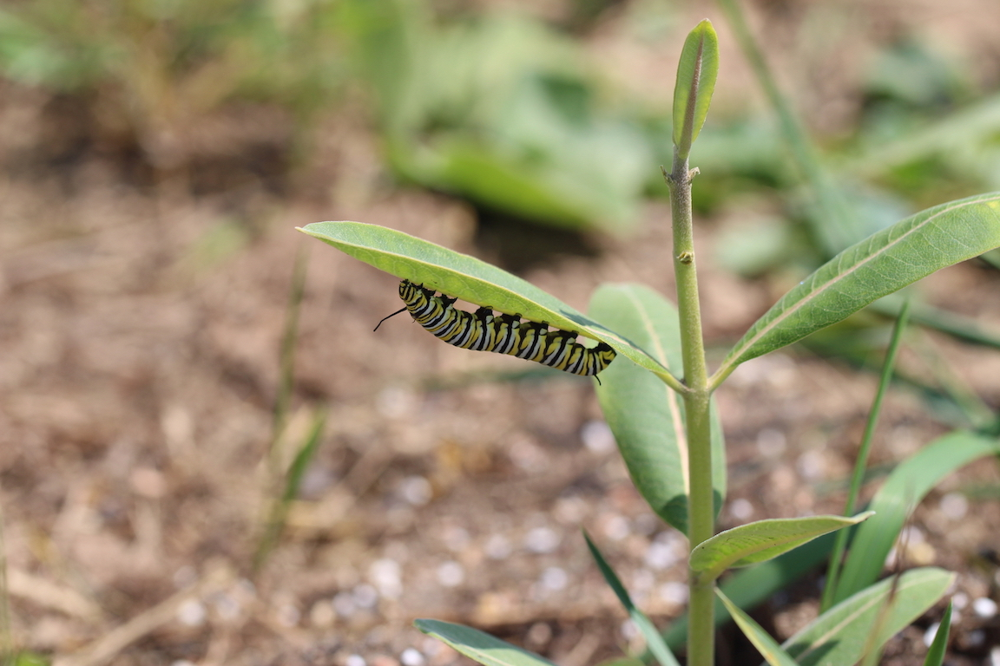

```{r setup, include=FALSE}
knitr::opts_chunk$set(echo = TRUE)
```


Below are pdfs of our main sampling protocols. Collaborators should have access to our Shared Drive, which has the most up-to-date versions and additional information. Please get in touch if you need access to the Shared Drive.

[HerbVar Primary Protocol](protocols/Primary protocol for herbivory variability network.pdf). This is the primmary protocol for HerbVar surveys. We designed this to work for most plant species and sites.  

[Reproductive Damage Protocol](protocols/HerbVar Reproductive Damage Protocol.pdf). If your plants have reproductive tissues (flowers, fruits, seeds), please follow this protocol to quantify damage to these tissues.

[Rare Plants Protocol](protocols/HerbVar Surveying low-density_low-abundance sites.pdf). If your plants are rare at your site---such that they occur at low densities or abundances---then please refer to this protocol.

[Cacti and Other Succulents Protocol](protocols/HerbVar Cactus and Succulent Protocol.pdf). This document discusses issues related to quantifying herbivory on cacti and other succulents and outlines a protocol. 

[Insect Sampling Protocol](protocols/HerbVar Herbivore sampling_ protocol.pdf). This document discusses *if and how* to sample insects.

```{r, echo=FALSE, out.width = "600px", fig.align='center'}

```