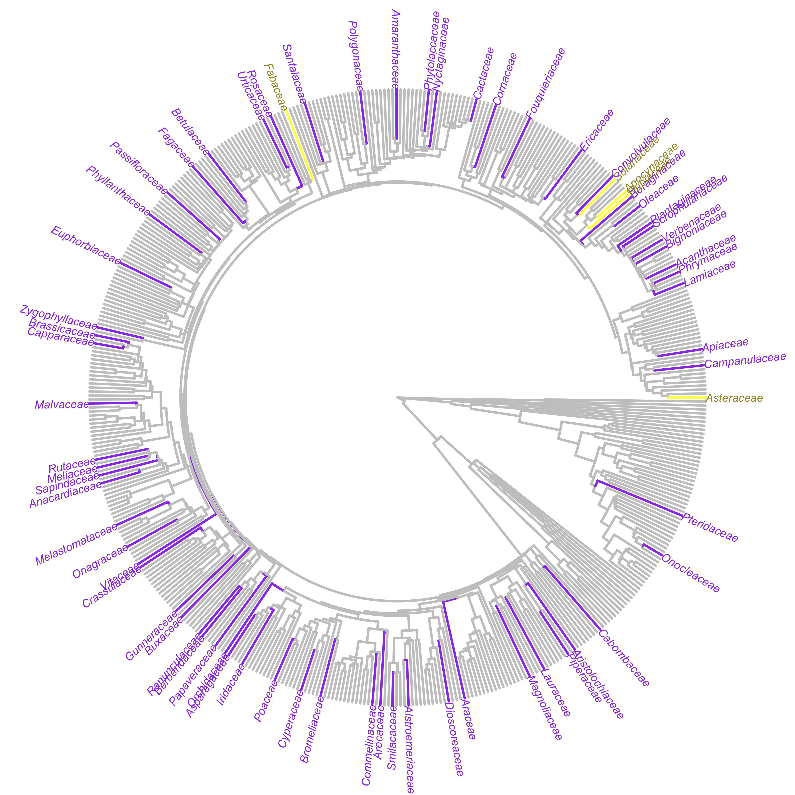

```{r setup, include=FALSE}

# Load packages for this page
library(googlesheets4)
library(ggplot2)
library(viridis)
library(knitr)
library(ggmap)
library(tidyverse)

# Load metadata on completed surveys
sheets_deauth()
d = read_sheet("https://docs.google.com/spreadsheets/d/1mNYnSTCs9WYy5SN2HF4VYep550Sccz9xU5o8JuYut-A/edit?usp=sharing",
           sheet='Completed surveys')
d = data.frame(d)


# Load planned site locations
planned = read_sheet("https://docs.google.com/spreadsheets/d/1avm6eedbaLt3V1E3q2lg6IuUs7mPPEKWcsvlhWsfqk4/edit?usp=sharing",
           sheet='planned surveys')
planned = data.frame(planned)

# Load meta data on focal species
dfs = read_sheet("https://docs.google.com/spreadsheets/d/1mNYnSTCs9WYy5SN2HF4VYep550Sccz9xU5o8JuYut-A/edit?usp=sharing",
           sheet='Focal_species')
dfs = data.frame(dfs)

focalFam = function(z) # define function to ID focal families in data frame
	ifelse(z == 'Apocynaceae' | z == 'Asteraceae' | z == 'Fabaceae' | z == 'Solanaceae' |
		z == 'Rubiaceae', TRUE, FALSE)
d$focalFamily = focalFam(d$plantFamily)

d.complete = d[!is.na(d$plantFamily),] # data.frame for complete entries

```

The Herbivory Variability Network has completed `r nrow(d)` surveys on `r length(unique(d.complete$Genus_sp))` plant species from `r length(unique(d.complete$plantFamily))` plant families. These figures and tables update as new data are entered into our database, so check back often! 

We have a three-scaled sampling approach:

1. Sampling one plant species from as many plant families as possible
2. Sampling as many species (and tribes and genera) as possible from five focal families (Apocynaceae, Asteraceae, Fabaceae, Rubiaceae, and Solanaceae)
3. Sampling as many sites as possible for two focal species (_Taraxacum officinale_ and _Plantago major_). 

The goal of this stratified sampling plan is to avoid potential biases in geographic and/or taxonomic coverage, as well as to permit robust exploration of factors that shape patterns in herbivory.

Below we show the current status of our sampling for each of the three scales of sampling, our overall geographic extent, and finally our current plant species list. This information is here to share our progress and help collaborators pick sites and species to survey.

<br>

## Sampling across plant families

```{r, echo=FALSE, out.width = "600px", fig.align='center', fig.cap="The distribution of currently sampled plant families across the phylogeny of all extant vascular plant families. Our five focal families are in yellow (Apocynaceae, Asteraceae, Fabaceae, Rubiaceae, and Solanaceae), and other sampled families are in purple. Figure made by HerbVar collaborator [Marjorie Weber](http://www.theweberlab.com) with mega-tree from Jin et al. 2019." }

```

<br>

## Sampling within plant families

```{r, echo=FALSE, fig.align='center', fig.width=5, fig.asp=1.5, fig.cap="Number of completed surveys per plant family. Our five focal families are in yellow (Apocynaceae, Asteraceae, Fabaceae, Rubiaceae, and Solanaceae)."}

ggplot(d.complete, aes(x=plantFamily, fill=focalFamily)) + geom_bar() + coord_flip() + 
	ylab('No. surveys') + xlab('Plant family') + theme_classic() +
	scale_fill_viridis(discrete=TRUE, alpha=0.8) + theme(legend.position = "none")
```

<br>

## Sampling within focal species

We have two focal species that we are aiming to sampling across the broadest possible geographic extent and across broad environmental gradients. This is the newest part of our sampling effort, so we are just starting to collect these data.

```{r, include=FALSE}
map.world = map_data('world')


dfs$Taraxacum.count = as.integer(dfs$Taraxacum.count)
dfs$Plantago.count = as.integer(dfs$Plantago.count)

map.world$region[map.world$region == 'USA'] = 'United States'
map.world$region[map.world$region == 'UK'] = 'United Kingdom'
map.world$region[map.world$region == 'Russia'] = 'Russian Federation'
map.world$region[map.world$region == 'Democratic Republic of the Congo'] = 'The Democratic Republic of The Congo'
map.world$region[map.world$region == 'Republic of Congo'] = 'Congo'


anti_join(dfs, map.world, by=c('Country' = 'region'))

focal.sp.map.data = left_join(map.world, dfs, by = c('region' = 'Country'))

# For countries not in the list (because of match problems), set count to zero
# Check on this and fix matches as we add countries!
focal.sp.map.data$Taraxacum.count[is.na(focal.sp.map.data$Taraxacum.count)] = 0
focal.sp.map.data$Plantago.count[is.na(focal.sp.map.data$Plantago.count)] = 0
```


```{r, echo=FALSE, out.width="600px", fig.asp=0.5, fig.align='center'}

# Plot it
ggplot(focal.sp.map.data, aes( x= long, y = lat, group = group)) +
  geom_polygon(aes(fill = Taraxacum.count)) +
  scale_fill_gradient(low='grey80', high=viridis(2)[2], breaks=0:max(focal.sp.map.data$Taraxacum.count)) +
  guides(fill = guide_legend(reverse = T)) +
  labs(fill = 'No. surveys'
       ,title = expression(~italic('Taraxacum officinale')~'surveys by country')
       ,subtitle = NULL
       ,x = NULL
       ,y = NULL) +
  theme_bw() +
	theme(axis.title=element_blank(), axis.text=element_blank(),
		axis.ticks=element_blank()) +
	coord_fixed()
```

```{r, echo=FALSE, out.width="600px", fig.asp=0.5, fig.align='center'}
ggplot(focal.sp.map.data, aes( x= long, y = lat, group = group)) +
  geom_polygon(aes(fill = Plantago.count)) +
  scale_fill_gradient(low='grey80', high=viridis(2)[2], breaks=0:max(focal.sp.map.data$Plantago.count)) +
  guides(fill = guide_legend(reverse = T)) +
  labs(fill = 'No. surveys'
       ,title = expression(~italic('Plantago major')~'surveys by country')
       ,subtitle = NULL
       ,x = NULL
       ,y = NULL) +
  theme_bw() +
	theme(axis.title=element_blank(), axis.text=element_blank(),
		axis.ticks=element_blank()) +
	coord_fixed()

```

<br>

## Geographic extent

A map of our sampling progress.

```{r, echo=FALSE, out.width = "800px", fig.asp=0.5, fig.align='center', fig.cap="Sampling areas with at least one completed survey (yellow) and planned sampling areas (purple). We’re continually adding new planned sites."}
mapWorld = borders("world", colour="gray80", fill="gray80") # create a layer of borders
ggplot() + 
	mapWorld + 
	theme_bw() + 
	theme(axis.title=element_blank(), axis.text=element_blank(),
		axis.ticks=element_blank()) + 
	geom_point(aes(x=planned$longitude.location, y=planned$latitude.location), fill=viridis(2,)[1], size=1.25,
		shape=21, alpha=0.5) +
	geom_point(aes(x=d$longitude.location, y=d$latitude.location), fill=viridis(2)[2], size=1.75, shape=21) +
	coord_fixed()
```

<br>

## Species list

Our current species list with the number of surveys completed for each species.

```{r, echo=FALSE}
Genus_sp.form = paste('*', d.complete$Genus_sp, '*', sep='')
Genus_sp.form = sub('_', ' ', Genus_sp.form)
num.spp = table(Genus_sp.form)
kable(num.spp, col.names=c('Plant species', 'No. surveys'), align=c('l','l'))
```

